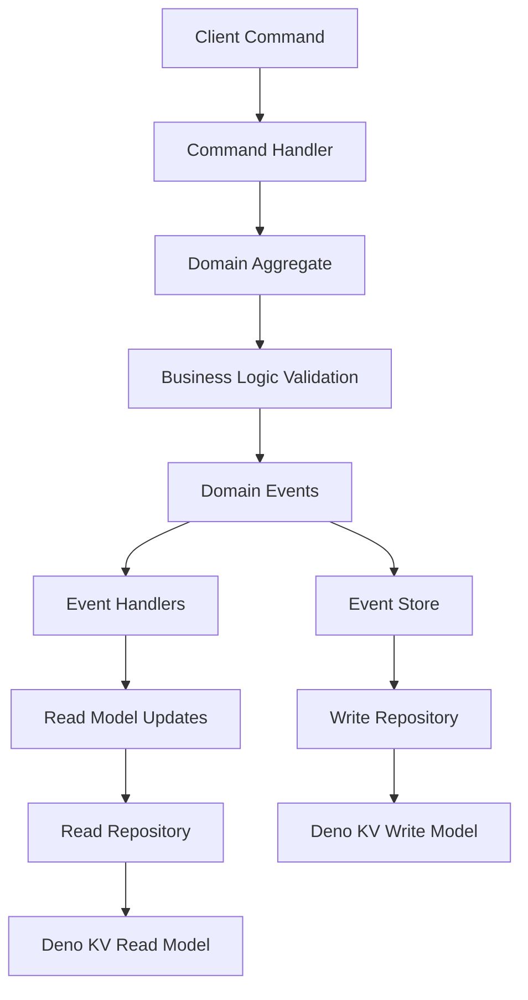
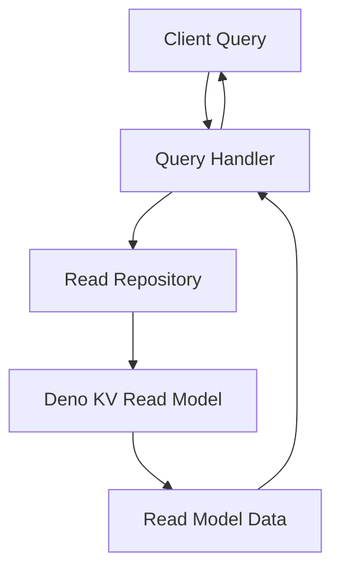
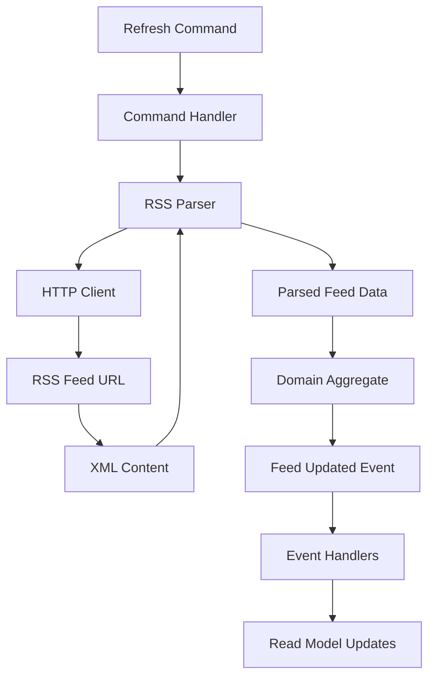

# Design Document

## Overview

The RSS Feed Library is designed as a modular, domain-driven solution for Deno
applications that need to parse, manage, and persist RSS feed data. The
architecture follows DDD principles with CQRS (Command Query Responsibility Segregation)
pattern, providing clear separation between write operations (commands) and read
operations (queries). This separation allows for optimized performance, scalability,
and maintainability. Deno KV serves as the persistence layer for both write and
read models, providing a lightweight yet robust storage solution.

## Architecture

The library follows a CQRS-based layered architecture pattern:

```
┌─────────────────────────────────────────────────────────────┐
│                    Application Layer                        │
│  ┌─────────────────────┐    ┌─────────────────────────────┐ │
│  │   Command Side      │    │        Query Side           │ │
│  │ (Command Handlers)  │    │    (Query Handlers)         │ │
│  └─────────────────────┘    └─────────────────────────────┘ │
├─────────────────────────────────────────────────────────────┤
│                      Domain Layer                           │
│  (Entities, Value Objects, Domain Events, Business Rules)   │
├─────────────────────────────────────────────────────────────┤
│                   Infrastructure Layer                      │
│  ┌─────────────────────┐    ┌─────────────────────────────┐ │
│  │   Write Model       │    │       Read Model            │ │
│  │  (Event Store,      │    │   (Query Repositories,      │ │
│  │   Repositories)     │    │    Projections)             │ │
│  └─────────────────────┘    └─────────────────────────────┘ │
└─────────────────────────────────────────────────────────────┘
```

### Core Principles

- **Domain-Driven Design**: Clear domain models and business logic separation
- **CQRS**: Separate command and query responsibilities for optimal performance
- **Event-Driven Architecture**: Domain events drive read model updates
- **Dependency Inversion**: Infrastructure depends on domain abstractions
- **Single Responsibility**: Each component has a focused purpose
- **Test-Driven Development**: Comprehensive test coverage for reliability

## Components and Interfaces

### Domain Layer

#### Feed Entity

```typescript
class Feed {
  constructor(
    private id: FeedId,
    private url: FeedUrl,
    private metadata: FeedMetadata,
    private items: FeedItem[],
    private lastUpdated: Date,
  );
}
```

#### FeedItem Entity

```typescript
class FeedItem {
  constructor(
    private id: FeedItemId,
    private title: string,
    private description: string,
    private link: string,
    private publishedDate: Date,
    private guid: string,
  );
}
```

#### Value Objects

- `FeedId`: Unique identifier for feeds
- `FeedUrl`: Validated URL value object
- `FeedMetadata`: Contains title, description, language, etc.

### Application Layer

#### Command Side

##### Commands

```typescript
interface AddFeedCommand {
  url: string;
  userId?: string;
}

interface UpdateFeedCommand {
  feedId: FeedId;
  url?: string;
}

interface DeleteFeedCommand {
  feedId: FeedId;
}

interface RefreshFeedCommand {
  feedId: FeedId;
}
```

##### Command Handlers

```typescript
interface CommandHandler<T> {
  handle(command: T): Promise<void>;
}

interface AddFeedCommandHandler extends CommandHandler<AddFeedCommand> {}
interface UpdateFeedCommandHandler extends CommandHandler<UpdateFeedCommand> {}
interface DeleteFeedCommandHandler extends CommandHandler<DeleteFeedCommand> {}
interface RefreshFeedCommandHandler extends CommandHandler<RefreshFeedCommand> {}
```

#### Query Side

##### Queries

```typescript
interface GetFeedQuery {
  feedId: FeedId;
}

interface GetAllFeedsQuery {
  userId?: string;
  limit?: number;
  offset?: number;
}

interface GetFeedItemsQuery {
  feedId: FeedId;
  limit?: number;
  since?: Date;
}
```

##### Query Handlers

```typescript
interface QueryHandler<TQuery, TResult> {
  handle(query: TQuery): Promise<TResult>;
}

interface GetFeedQueryHandler extends QueryHandler<GetFeedQuery, FeedReadModel | null> {}
interface GetAllFeedsQueryHandler extends QueryHandler<GetAllFeedsQuery, FeedSummaryReadModel[]> {}
interface GetFeedItemsQueryHandler extends QueryHandler<GetFeedItemsQuery, FeedItemReadModel[]> {}
```

##### Read Models

```typescript
interface FeedReadModel {
  id: string;
  url: string;
  title: string;
  description: string;
  lastUpdated: Date;
  itemCount: number;
}

interface FeedSummaryReadModel {
  id: string;
  title: string;
  url: string;
  lastUpdated: Date;
  itemCount: number;
}

interface FeedItemReadModel {
  id: string;
  feedId: string;
  title: string;
  description: string;
  link: string;
  publishedDate: Date;
  guid: string;
}
```

### Infrastructure Layer

#### Write Side Repositories

```typescript
interface FeedWriteRepository {
  save(feed: Feed): Promise<void>;
  findById(id: FeedId): Promise<Feed | null>;
  delete(id: FeedId): Promise<void>;
}

interface EventStore {
  saveEvents(aggregateId: string, events: DomainEvent[], expectedVersion: number): Promise<void>;
  getEvents(aggregateId: string): Promise<DomainEvent[]>;
}
```

#### Read Side Repositories

```typescript
interface FeedReadRepository {
  getFeed(id: FeedId): Promise<FeedReadModel | null>;
  getAllFeeds(userId?: string, limit?: number, offset?: number): Promise<FeedSummaryReadModel[]>;
  getFeedItems(feedId: FeedId, limit?: number, since?: Date): Promise<FeedItemReadModel[]>;
}
```

#### Domain Events

```typescript
interface DomainEvent {
  aggregateId: string;
  eventType: string;
  eventData: any;
  timestamp: Date;
  version: number;
}

interface FeedAddedEvent extends DomainEvent {
  eventType: 'FeedAdded';
  eventData: {
    feedId: string;
    url: string;
    title: string;
    description: string;
  };
}

interface FeedUpdatedEvent extends DomainEvent {
  eventType: 'FeedUpdated';
  eventData: {
    feedId: string;
    newItems: FeedItemData[];
    lastUpdated: Date;
  };
}

interface FeedDeletedEvent extends DomainEvent {
  eventType: 'FeedDeleted';
  eventData: {
    feedId: string;
  };
}
```

#### Event Handlers / Projections

```typescript
interface EventHandler<T extends DomainEvent> {
  handle(event: T): Promise<void>;
}

interface FeedProjectionHandler {
  handleFeedAdded(event: FeedAddedEvent): Promise<void>;
  handleFeedUpdated(event: FeedUpdatedEvent): Promise<void>;
  handleFeedDeleted(event: FeedDeletedEvent): Promise<void>;
}
```

#### RSSParser

```typescript
interface RSSParser {
  parse(xmlContent: string): Promise<ParsedFeedData>;
}
```

## Data Models

### Storage Schema (Deno KV)

#### Write Model Storage

- Key: `["write_model", "feeds", feedId]`
- Value: Serialized Feed aggregate with full domain data

#### Event Store

- Key: `["events", aggregateId, version]`
- Value: Serialized domain event
- Key: `["event_stream", aggregateId]`
- Value: Array of event versions for aggregate

#### Read Model Storage

##### Feed Read Models
- Key: `["read_model", "feeds", feedId]`
- Value: Optimized FeedReadModel for queries

##### Feed Summary Read Models
- Key: `["read_model", "feed_summaries", feedId]`
- Value: Lightweight FeedSummaryReadModel for listing

##### Feed Items Read Models
- Key: `["read_model", "feed_items", feedId, itemId]`
- Value: FeedItemReadModel for item queries

##### Indexes
- Key: `["read_model", "indexes", "feeds_by_user", userId, feedId]`
- Value: feedId (for user-specific feed queries)
- Key: `["read_model", "indexes", "items_by_date", feedId, publishedDate, itemId]`
- Value: itemId (for chronological item queries)

### Data Flow

#### Command Flow


#### Query Flow


#### RSS Parsing Flow


## Error Handling

### Error Types

- `InvalidUrlError`: Malformed or unreachable URLs
- `ParseError`: RSS XML parsing failures
- `StorageError`: Deno KV operation failures
- `NotFoundError`: Requested feed doesn't exist
- `DuplicateError`: Attempting to add existing feed

### Error Handling Strategy

- Domain errors bubble up through application layer
- Infrastructure errors are wrapped in domain-appropriate exceptions
- All errors include contextual information for debugging
- Graceful degradation where possible

## Testing Strategy

### Unit Tests

- **Domain Entities**: Test business logic and invariants
- **Value Objects**: Validate construction and behavior
- **Services**: Mock dependencies and test use cases
- **Parsers**: Test with various RSS feed formats

### Integration Tests

- **Deno KV Operations**: Test actual storage and retrieval
- **RSS Parsing**: Test with real RSS feeds
- **End-to-End Workflows**: Complete user scenarios

### Test Structure

```
tests/
├── unit/
│   ├── domain/
│   ├── application/
│   └── infrastructure/
├── integration/
│   ├── storage/
│   └── parsing/
└── fixtures/
    └── sample-feeds/
```

### Testing Tools

- Deno's built-in test runner
- Mock implementations for external dependencies
- Test fixtures with various RSS feed formats
- Coverage reporting to ensure 90%+ coverage

### Test-Driven Development Process

1. Write failing test for new functionality
2. Implement minimal code to pass test
3. Refactor while maintaining test coverage
4. Repeat for each requirement
