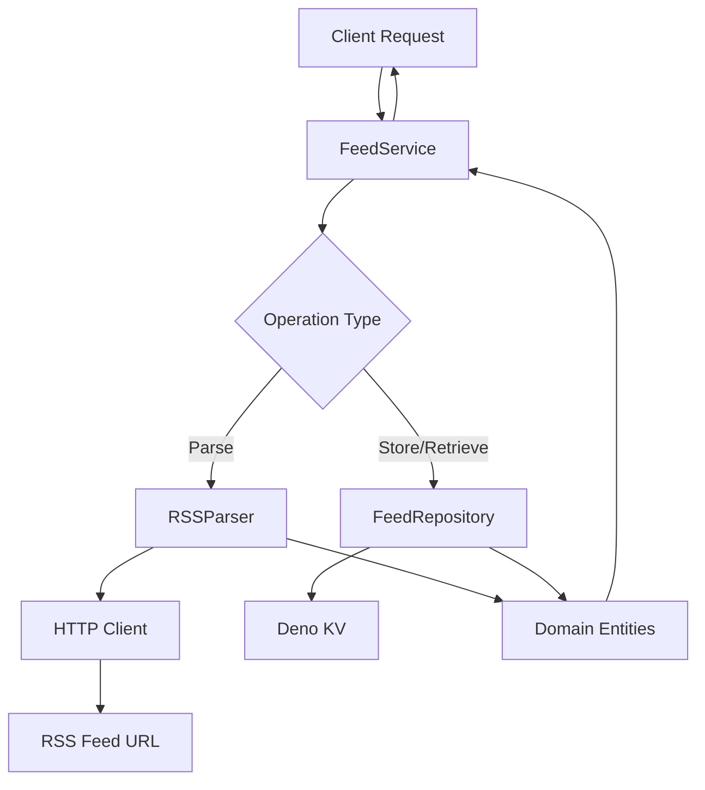

# Design Document

## Overview

The RSS Feed Library is designed as a modular, domain-driven solution for Deno
applications that need to parse, manage, and persist RSS feed data. The
architecture follows DDD principles with clear separation between domain logic,
application services, and infrastructure concerns. Deno KV serves as the
persistence layer, providing a lightweight yet robust storage solution.

## Architecture

The library follows a layered architecture pattern:

```
┌─────────────────────────────────────┐
│           Application Layer         │
│  (Feed Services, Use Cases)         │
├─────────────────────────────────────┤
│            Domain Layer             │
│  (Entities, Value Objects, Rules)   │
├─────────────────────────────────────┤
│         Infrastructure Layer        │
│  (Repositories, External Services)  │
└─────────────────────────────────────┘
```

### Core Principles

- **Domain-Driven Design**: Clear domain models and business logic separation
- **Dependency Inversion**: Infrastructure depends on domain abstractions
- **Single Responsibility**: Each component has a focused purpose
- **Test-Driven Development**: Comprehensive test coverage for reliability

## Components and Interfaces

### Domain Layer

#### Feed Entity

```typescript
class Feed {
  constructor(
    private id: FeedId,
    private url: FeedUrl,
    private metadata: FeedMetadata,
    private items: FeedItem[],
    private lastUpdated: Date,
  );
}
```

#### FeedItem Entity

```typescript
class FeedItem {
  constructor(
    private id: FeedItemId,
    private title: string,
    private description: string,
    private link: string,
    private publishedDate: Date,
    private guid: string,
  );
}
```

#### Value Objects

- `FeedId`: Unique identifier for feeds
- `FeedUrl`: Validated URL value object
- `FeedMetadata`: Contains title, description, language, etc.

### Application Layer

#### FeedService

```typescript
interface FeedService {
  parseFeed(url: string): Promise<Feed>;
  saveFeed(feed: Feed): Promise<void>;
  getFeed(id: FeedId): Promise<Feed | null>;
  getAllFeeds(): Promise<Feed[]>;
  updateFeed(id: FeedId): Promise<Feed>;
  deleteFeed(id: FeedId): Promise<void>;
}
```

### Infrastructure Layer

#### FeedRepository Interface

```typescript
interface FeedRepository {
  save(feed: Feed): Promise<void>;
  findById(id: FeedId): Promise<Feed | null>;
  findAll(): Promise<Feed[]>;
  delete(id: FeedId): Promise<void>;
}
```

#### DenoKVFeedRepository Implementation

Concrete implementation using Deno KV for persistence with optimized key
structures and efficient querying.

#### RSSParser

```typescript
interface RSSParser {
  parse(xmlContent: string): Promise<ParsedFeedData>;
}
```

## Data Models

### Storage Schema (Deno KV)

#### Feed Storage

- Key: `["feeds", feedId]`
- Value: Serialized Feed entity with metadata and items

#### Feed Index

- Key: `["feed_urls", url]` → `feedId`
- Purpose: Prevent duplicate URLs and enable URL-based lookups

#### Feed List

- Key: `["feed_list"]`
- Value: Array of feed IDs for efficient listing

### Data Flow



## Error Handling

### Error Types

- `InvalidUrlError`: Malformed or unreachable URLs
- `ParseError`: RSS XML parsing failures
- `StorageError`: Deno KV operation failures
- `NotFoundError`: Requested feed doesn't exist
- `DuplicateError`: Attempting to add existing feed

### Error Handling Strategy

- Domain errors bubble up through application layer
- Infrastructure errors are wrapped in domain-appropriate exceptions
- All errors include contextual information for debugging
- Graceful degradation where possible

## Testing Strategy

### Unit Tests

- **Domain Entities**: Test business logic and invariants
- **Value Objects**: Validate construction and behavior
- **Services**: Mock dependencies and test use cases
- **Parsers**: Test with various RSS feed formats

### Integration Tests

- **Deno KV Operations**: Test actual storage and retrieval
- **RSS Parsing**: Test with real RSS feeds
- **End-to-End Workflows**: Complete user scenarios

### Test Structure

```
tests/
├── unit/
│   ├── domain/
│   ├── application/
│   └── infrastructure/
├── integration/
│   ├── storage/
│   └── parsing/
└── fixtures/
    └── sample-feeds/
```

### Testing Tools

- Deno's built-in test runner
- Mock implementations for external dependencies
- Test fixtures with various RSS feed formats
- Coverage reporting to ensure 90%+ coverage

### Test-Driven Development Process

1. Write failing test for new functionality
2. Implement minimal code to pass test
3. Refactor while maintaining test coverage
4. Repeat for each requirement
